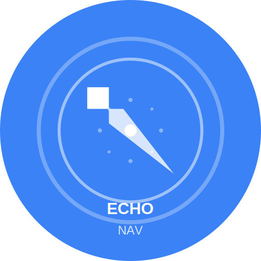

# Echo Nav - 个人导航主页



Echo Nav是一个现代化的个人导航主页，帮助您管理和快速访问常用网站。

## 🌟 特性

- **网站管理** - 添加、编辑、删除和分类您的网站
- **响应式设计** - 在任何设备上都有出色的体验
- **实时搜索** - 快速找到您需要的网站
- **主题切换** - 支持亮色和暗色模式
- **GitHub同步** - 通过GitHub Gist同步您的数据
- **PWA支持** - 可安装为本地应用
- **键盘快捷键** - 提高使用效率

## 🚀 快速开始

### 开发环境

```bash
# 安装依赖
pnpm install

# 启动开发服务器
pnpm dev
```

### 生产环境

```bash
# 构建生产版本
pnpm build

# 预览构建结果
pnpm preview
```

## 📦 部署

Echo Nav可以轻松部署到Cloudflare Pages。详细说明请参阅[部署文档](docs/DEPLOYMENT.md)。

### 使用GitHub Actions自动部署

项目已配置GitHub Actions工作流，可以在推送到主分支时自动部署到Cloudflare Pages。

### 手动部署

```bash
# 构建项目
pnpm build

# 使用Wrangler部署
pnpm deploy:production
```

## 🔧 环境变量

复制`.env.example`文件为`.env.local`并填入您的配置：

```
# GitHub认证（可选）
VITE_GITHUB_CLIENT_ID=your_github_client_id
VITE_GITHUB_CLIENT_SECRET=your_github_client_secret
```

## 📱 PWA功能

Echo Nav支持PWA（渐进式Web应用）功能，可以安装到您的设备上：

- 离线支持
- 主屏幕图标
- 全屏体验
- 自动更新

## 🛠️ 技术栈

- [Vue 3](https://vuejs.org/) - 渐进式JavaScript框架
- [TypeScript](https://www.typescriptlang.org/) - 类型安全
- [Vite](https://vitejs.dev/) - 下一代前端构建工具
- [Tailwind CSS](https://tailwindcss.com/) - 实用优先的CSS框架
- [Pinia](https://pinia.vuejs.org/) - Vue状态管理
- [Vue Router](https://router.vuejs.org/) - Vue路由管理

## 📄 许可证

[MIT](LICENSE)
